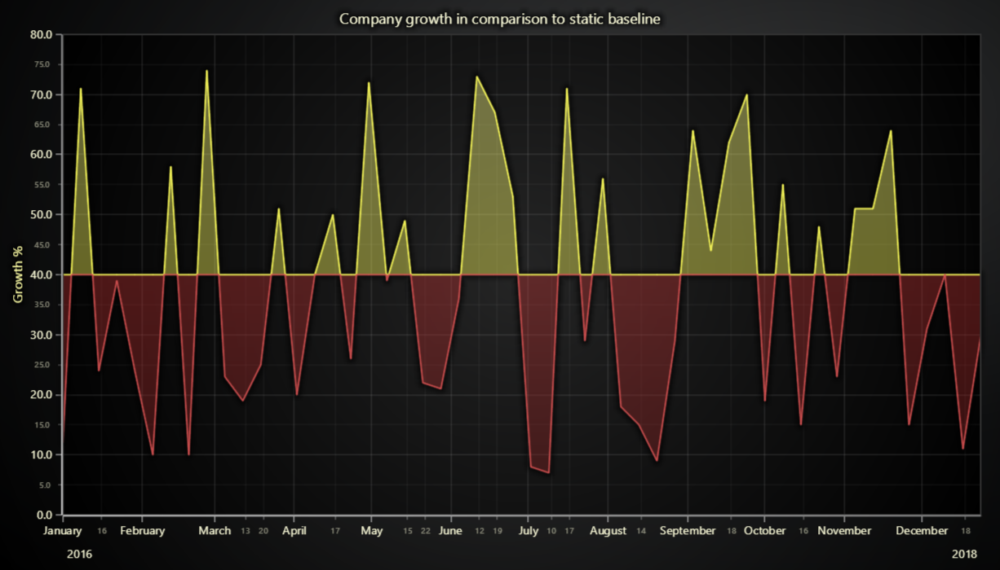

# Area Bipolar JavaScript Chart



This demo application belongs to the set of examples for LightningChart JS, data visualization library for JavaScript.

LightningChart JS is entirely GPU accelerated and performance optimized charting library for presenting massive amounts of data. It offers an easy way of creating sophisticated and interactive charts and adding them to your website or web application.

The demo can be used as an example or a seed project. Local execution requires the following steps:

-   Make sure that relevant version of [Node.js](https://nodejs.org/en/download/) is installed
-   Open the project folder in a terminal:

          npm install              # fetches dependencies
          npm start                # builds an application and starts the development server

-   The application is available at _http://localhost:8080_ in your browser, webpack-dev-server provides hot reload functionality.


## Description

_Also known as a Area Graph, Area Chart or Area Chart with Negative values_

The example shows the basic usage of a bipolar area series. The area series is based on **_line series_** with the area between the baseline and the given data filled with color. It is drawn on a Cartesian coordinate system and represents the quantitative data.

Current example chart contains one bipolar area series. The data is drawn from both sides of the specified baseline.

The simple area chart can be created with few simple lines of code:

```javascript
// Create a new ChartXY.
const chart = lightningChart().ChartXY()

// Add an area series with bipolar direction using default X and Y axes.
const areaBipolar = chart.addAreaSeries({
    baseline: 0,
    type: AreaSeriesTypes.Both,
})
```

The baseline value the type of number and the type can be specified only during the creation of a series instance, where

-   The baseline is a fixed reference level of minimum or starting point used for comparisons, which allow customizing the position of the area.

-   The type of area series is an enum selector which defines the type of area series:
    -   Select AreaSeriesTypes.Both to show the data from both sides of the baseline.

The series accepts points in format `{ x: number, y: number }`. Any number of points can be added with a single call.

```javascript
// Single point.
series.add({ x: 50, y: 60 })

// Multiple points at once.
series.add([
    { x: 55, y: 60 },
    { x: 60, y: 62 },
    { x: 65, y: 65 },
])
```


## API Links

* [XY cartesian chart]
* [Area series]
* [Area type]
* [Bipolar Area series]


## Support

If you notice an error in the example code, please open an issue on [GitHub][0] repository of the entire example.

Official [API documentation][1] can be found on [LightningChart][2] website.

If the docs and other materials do not solve your problem as well as implementation help is needed, ask on [StackOverflow][3] (tagged lightningchart).

If you think you found a bug in the LightningChart JavaScript library, please contact sales@lightningchart.com.

Direct developer email support can be purchased through a [Support Plan][4] or by contacting sales@lightningchart.com.

[0]: https://github.com/Arction/
[1]: https://lightningchart.com/lightningchart-js-api-documentation/
[2]: https://lightningchart.com
[3]: https://stackoverflow.com/questions/tagged/lightningchart
[4]: https://lightningchart.com/support-services/

© LightningChart Ltd 2009-2022. All rights reserved.


[XY cartesian chart]: https://lightningchart.com/js-charts/api-documentation/v8.0.0/classes/ChartXY.html
[Area series]: https://lightningchart.com/js-charts/api-documentation/v8.0.0/classes/ChartXY.html#addAreaSeries
[Area type]: https://lightningchart.com/js-charts/api-documentation/v8.0.0/AreaSeriesTypes.html
[Bipolar Area series]: https://lightningchart.com/js-charts/api-documentation/v8.0.0/classes/AreaSeriesBipolar.html

